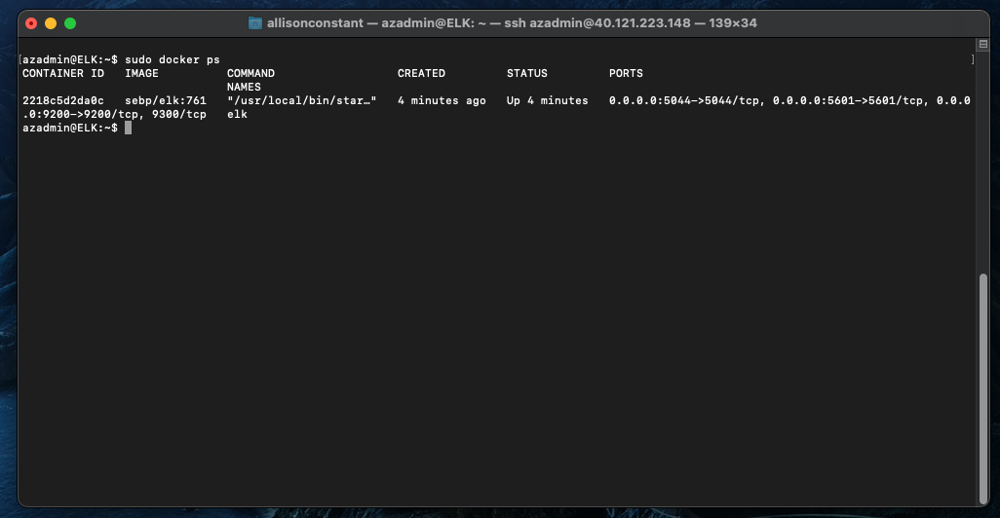

## Automated ELK Stack Deployment

The files in this repository were used to configure the network depicted below.


These files have been tested and used to generate a live ELK deployment on Azure. They can be used to either recreate the entire deployment pictured above. Alternatively, select portions of the YAML file may be used to install only certain pieces of it, such as Filebeat.

```
---
- name: Configure Elk VM with Docker
  hosts: elkservers
  remote_user: azadmin
  become: true
  tasks:
    # Use apt module
    - name: Install docker.io
      apt:
        update_cache: yes
        force_apt_get: yes
        name: docker.io
        state: present

      # Use apt module
    - name: Install python3-pip
      apt:
        force_apt_get: yes
        name: python3-pip
        state: present

      # Use pip module (It will default to pip3)
    - name: Install Docker module
      pip:
        name: docker
        state: present

      # Use command module
    - name: Increase virtual memory
      command: sysctl -w vm.max_map_count=262144

      # Use sysctl module
    - name: Use more memory
      sysctl:
        name: vm.max_map_count
        value: "262144"
        state: present
        reload: yes

      # Use docker_container module
    - name: download and launch a docker elk container
      docker_container:
        name: elk
        image: sebp/elk:761
        state: started
        restart_policy: always

        # Please list the ports that ELK runs on
        published_ports:
          -  5601:5601
          -  9200:9200
          -  5044:5044

      # Use systemd module
    - name: Enable service docker on boot
      systemd:
        name: docker
        enabled: yes
  ```

This document contains the following details:
- Description of the Topology
- Access Policies
- ELK Configuration
  - Beats in Use
  - Machines Being Monitored
- How to Use the Ansible Build


### Description of the Topology

The main purpose of this network is to expose a load-balanced and monitored instance of DVWA, the D*mn Vulnerable Web Application.

Load balancing ensures that the application will be highly available, in addition to restricting connections to the network.

Integrating an ELK server allows users to easily monitor the vulnerable VMs for changes to the log files and system metrics.

The configuration details of each machine may be found below.

| Name       | Function  | IP Address | Operating System |
|------------|-----------|------------|------------------|
| Jump Box   | Gateway   | 10.0.0.4   | Linux            |
| Web-1      | Webserver | 10.0.0.5   | Linux            |
| Web-2      | Webserver | 10.0.0.6   | Linux            |
| Web-3      | Webserver | 10.0.0.7   | Linux            |
| ELK Server | Monitoring| 10.1.0.4   | Linux            |

### Access Policies

The machines on the internal network are not exposed to the public Internet. 

Only the jump box provisioner machine can accept connections from the Internet. Access to this machine is only allowed from the following IP addresses: 74.103.184.73


Machines within the network can only be accessed by the jump box provisioner from the IP address 10.0.0.4.

A summary of the access policies in place can be found in the table below.

| Name      | Publicly Accessible | Allowed IP Addresses |
|-----------|---------------------|----------------------|
| Jump Box  | Yes                 | 74.103.184.73        |
| Web-1     | No                  | 10.0.0.4             |
| Web-2     | No                  | 10.0.0.4             |
| Web-3     | No                  | 10.0.0.4             |
| ELK Server| No                  | 10.0.0.4             |

### Elk Configuration

Ansible was used to automate configuration of the ELK machine. No configuration was performed manually, which is advantageous because...
- thousands of machines can be setup with a smaller chance of human error and more efficiently without expending too many rescources.

The playbook implements the following tasks:
- Install docker.io, including update cache and force apt get
- Install python3-pip
- Install docker with pip module
- Increase the virtual memory by increasing the vm.max_map_count=262144
- Download and launch the docker elk container with the restart policy set to always and download sebp/elk:761 image
- Include the ports for ELK to run on
- Finally, enable docker to start on boot

The following screenshot displays the result of running `docker ps` after successfully configuring the ELK instance.



### Target Machines & Beats
This ELK server is configured to monitor the following machines:

| Name  | IP Address |
|-------|------------|
| Web-1 | 10.0.0.5   |
| Web-2 | 10.0.0.6   |
| Web-3 | 10.0.0.7   |

We have installed the following Beats on these machines:
- Filebeat and Metricbeat

These Beats allow us to collect the following information from each machine:
- Filebeat collects data about the file system such as the authorization system being stopped is logged using filebeat. Metricbeat collects operating system metrics such as CPU usage. 

### Using the Playbook
In order to use the playbook, you will need to have an Ansible control node already configured. Assuming you have such a control node provisioned: 

SSH into the control node and follow the steps below:
- Copy the playbook file to /etc/ansible/files
- Update the hosts file to include the webservers IP addresses and update the playbook file so that hosts is webservers. The IP addresses for the webservers and elkservers are different. Filebeat and metricbeat are being installed on the webservers while the elk docker container has a different IP address which is also edited in the hosts file.
- Run the playbook, and navigate to http://13.66.200.56:5601/app/kibana#/home?_g=() to check that the installation worked as expected.

_As a **Bonus**, provide the specific commands the user will need to run to download the playbook, update the files, etc._

- To download the filebeat playbook `curl https://gist.githubusercontent.com/slape/5cc350109583af6cbe577bbcc0710c93/raw/eca603b72586fbe148c11f9c87bf96a63cb25760/Filebeat > /etc/ansible/files/filebeat-config.yml`
- Change hosts to webservers
- Download the filebeat deb from kibana using the curl command
- Install filebeat using `dpkg -i`
- To enable and configure the module use the command `filebeat modiles enable system`
- To setup filebeat use the command `filebeat setup`
- To start filebeat use the command `service filebeat start`
- To enable on boot use systemd with the name: filebeat and enabled: yes
- Once the filebeat playbook file is created and saved, run it with the command `ansible-playbook <filename.yml>`
